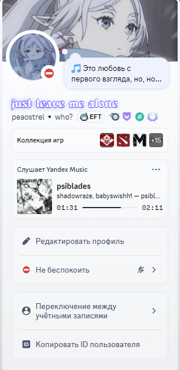

# VEINYMusic // YANDEX RPC

  

<div align="center">
  
</div>

Бескомпромиссная интеграция Яндекс Музыки в Discord Rich Presence. 
Разработано для экосистемы **VEIN**. Работает напрямую через медиа-сессии ядра Windows (SMTC), без костылей с расширениями для браузеров. 

Основной функционал (Rich Presence) полностью работоспособен **без каких-либо токенов**! Токены требуются только для дополнительных функций (синхронизация текста песен в статус Discord и точный поиск обложек напрямую через API Яндекс.Музыки).

---

## 🔥 ФУНКЦИИ И ВОЗМОЖНОСТИ

- **Discord Rich Presence (Игровой статус)**:
  - Отображает название трека, исполнителя и альбом в профиле Discord.
  - **Динамический прогресс-бар**: Идеальная синхронизация таймингов (Progress Bar) с плеером с точностью до миллисекунды.
  - **Интерактивные кнопки**: Добавляет кнопки «Слушать трек» и «Открыть альбом», ведущие прямо на веб-страницы Яндекс Музыки.
  - **Высококачественные обложки**: Загрузка оригинальных обложек альбомов в высоком разрешении (400x400) напрямую с серверов Яндекса.

- **System Tray Mode (Фоновый режим)**: 
  - Сверните окно консоли в системный трей и забудьте о его существовании. Полное управление программой доступно через иконку в области уведомлений.

- **Запуск при старте системы (Автозагрузка)**:
  - Удобный переключатель прямо в меню трея. Скрипт сам создаст или удалит ярлык запуска в системной папке автозагрузки Windows.

- **Smart Auto-Update (Автообновление)**: 
  - Скрипт автоматически сверяет версию с репозиторием GitHub при старте. Если доступна новая версия, он предложит обновиться в один клик без ручного скачивания файлов.

- **Zero-Install (Автоустановка зависимостей)**: 
  - Не нужно вручную устанавливать библиотеки через `pip install`. При первом запуске скрипт проверит окружение и сам доустановит все недостающие пакеты.

- **Strict Mode (Фильтрация YouTube/Twitch)**: 
  - Интеллектуальный фильтр системного звука Windows. В Discord попадет *только* музыка из Яндекс.Музыки. Запущенные параллельно видеоролики на YouTube или стримы на Twitch игнорируются, сохраняя ваш статус чистым.

- **Karaoke Status Sync (Текст песни в статус Discord)**: 
  - Трансляция текущей поющейся строчки песни в ваш кастомный статус (Custom Status) Discord в реальном времени. Синхронизируется с точностью до доли секунды, сбрасывается при паузе и автоматически возвращает ваш старый статус при закрытии программы или смене трека.

- **Автоматическая авторизация Yandex Music API (Device Flow)**:
  - Удобная авторизация через стандартный Device Flow Яндекса. Скрипт сам сгенерирует код, скопирует его в буфер обмена, откроет браузер и после вашего подтверждения сохранит токен в конфигурацию.

---

## 🚀 БЫСТРЫЙ СТАРТ

1. Убедитесь, что у вас установлен [Python 3.10+](https://www.python.org/).
2. Скачайте [yandex_presence.py](https://github.com/Peaostrel/VEINYMusic/blob/main/yandex_presence.py), `icon.png` и `RUN_ME.bat` в одну папку.
3. Запустите скрипт двойным кликом по `RUN_ME.bat` или выполните команду:
   ```bash
   python yandex_presence.py
   ```
   *Все зависимости установятся автоматически при первом запуске!*

---

## ⚙️ НАСТРОЙКА ТОКЕНОВ (ДОПОЛНИТЕЛЬНЫЕ ФУНКЦИИ)

### 🎵 1. Точный поиск и обложки (Токен Яндекс.Музыки)
Для получения 100% точных обложек альбомов, названий треков и ссылок напрямую через официальный API Яндекса (без использования сторонних баз Deezer/iTunes):
1. Нажмите правой кнопкой мыши на иконку в трее и кликните **«Токен Яндекс.Музыки: Не задан»**.
2. Откроется окно авторизации Яндекса в браузере, а код подтверждения скопируется в буфер обмена.
3. Вставьте код на странице активации и нажмите **Разрешить**.
4. Скрипт автоматически получит токен, закроет диалоговое окно авторизации и начнет поиск через API Яндекс.Музыки.

### 🎤 2. Слова песен в статусе Discord (Токен Discord)
Чтобы транслировать строчки поющейся песни прямо в ваш кастомный статус профиля Discord:
1. **Получите ваш токен Discord**:
   * Откройте Discord в браузере (Chrome / Yandex / Edge) и войдите в аккаунт.
   * Нажмите `F12` (или `Ctrl + Shift + I`) -> вкладка **Network** (Сеть).
   * Обновите страницу через `F5`.
   * В поле поиска (Filter) введите `/api`.
   * Выберите любой запрос (например, `library`), перейдите во вкладку **Headers** (Заголовки).
   * В разделе **Request Headers** найдите строку **`Authorization`** и скопируйте длинный буквенно-цифровой код.
2. **Включите функцию в трее**: Кликните правой кнопкой мыши по иконке VEINYMusic в системном трее и выберите **«Слова песен в статусе Discord»**.
3. **Вставьте токен**: В появившемся окне введите скопированный токен Discord.
4. **Тонкая регулировка таймингов**: Если текст спешит или отстает от звука, вы можете настроить задержку (lyrics_offset) через подменю **«Задержка слов»** в трее или вручную изменить значение `lyrics_offset` (в секундах) в созданном файле `config.json`.

---

## 🧠 АРХИТЕКТУРА И ПРИНЦИП РАБОТЫ

Скрипт использует гибридную систему (Hybrid Sync):

1. **Захват аудио из ядра Windows (SMTC):** Чтение официальной телеметрии операционной системы через модуль `winsdk`. Это позволяет видеть состояние воспроизведения любого плеера (включая веб-версии в браузерах и десктопное приложение Яндекс.Музыки).
2. **Фильтрация сессий:** Поиск активных сессий Яндекса по имени процесса или заголовку окна.
3. **Облачная подкачка метаданных:** Запросы к API Яндекс Музыки (с использованием авторизации) или сторонним поисковым базам (Deezer/iTunes) для автоматического поиска и генерации обложек.
4. **Синхронизация статуса:** Асинхронное обновление Discord RPC с использованием `pypresence` и REST API Discord для изменения кастомного статуса.

---

## 🛠 ТЕХНИЧЕСКИЙ СТЕК

- **pypresence** — Асинхронная работа с Discord IPC.
- **pystray & Pillow** — Управление системным треем и иконкой.
- **winsdk** — Прямой доступ к Windows System Media Transport Controls (SMTC).
- **rich** — Отрисовка стильного терминального интерфейса (TUI).
- **requests** — Запросы к API Яндекса, GitHub и базам метаданных.

---

## ⚠️ ВАЖНОЕ ЗАМЕЧАНИЕ ДЛЯ FIREFOX

Из-за внутренней архитектуры **Mozilla Firefox**, этот браузер транслирует в систему только *одну* активную медиа-сессию. Если вы слушаете Яндекс.Музыку и параллельно запускаете видео на YouTube в соседней вкладке — Firefox может скрыть музыку от Windows SMTC.
* **Решение**: Рекомендуется использовать официальное десктопное приложение Яндекс Музыка для Windows, либо Chromium-браузеры (Яндекс.Браузер, Chrome, Edge, Opera).

---

<div align="center">
    <b>VEIN ECOSYSTEM</b><br>
    <i>Engineered for perfection.</i>
</div>
